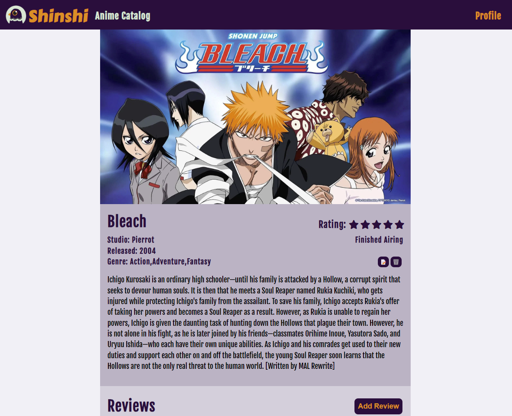
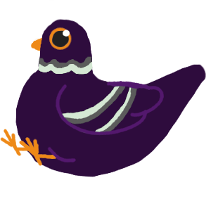

<code style="color:#EE8917">**Shinshi**</code> is a website that host detailed information about different animes to its community. 

<code style="color:#EE8917">**Shinshi**</code> borrows its name from the Japanese word for ‘divine messenger’ or <code style="color:#EE8917">神使</code>. In Japanese mythology, a shinshi can be any animal and they are used to transmit divine will or to bear oracles from Japanese Gods. <code style="color:#EE8917">**Shinshi's**</code> pigeon mascot is meant to bring information and reviews about Anime to its users.

## [Try out Shinshi Here](https://shinshi.fly.dev/) 
## [Planning materials](https://trello.com/b/VbLsp3jK/michelle-linares-anime-imbdpending-project-board) 

## Technologies used 🖥
- CSS
- JavaScript
- HTML
- EJS
- Google OAuth
- Git

## Attributions 📣

**Font** Shinshi uses [Carter One](https://fonts.google.com/specimen/Carter+One) designed by Vernon Adams as the logo font and  [Fjalla One](https://fonts.google.com/specimen/Fjalla+One) as the main website font. Sourced from [fonts.google.com](https://fonts.google.com/).

**Image assets** Shinshi's pigeon mascots is an original design. 

## Ice Box 🧊
- [x] Use API to Populate Database
- [ ] Fix Flag Display
- [ ] Fix Flag Display
- [ ] Mobile Responsive