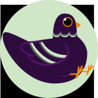

**Shinshi** is a website that hosts detailed information about different anime to its community. 
**Shinshi** borrows its name from the Japanese word for ‘divine messenger’ or 神使. In Japanese mythology, a shinshi can be any animal and they are used "to transmit divine will or to bear oracles" from Japanese Gods. **Shinshi's** pigeon mascot is meant to bring information and reviews about anime to its users. 

Read more about shinshi [Here](https://en.wikipedia.org/wiki/Shinshi).

At **Shinshi** all guests can see a **Home View** which displays the 10 most recent anime sorted by date of airing. Moving on to the **Catalog View**, guests see all anime listed on the website in alphabetical order. When an Anime is clicked, it will lead to the **Detail View** where guests will see detailed information about the anime as well as users reviews.

All users are able to create, edit, and delete reviews on the **Detail View**. Users can also navigate to their own **Watched view** and **Reviews view** when signed in. Users can use these views to track which anime they have watched and what reviews they have left.

Admins have the ability to add a new Anime to **Shinshi**. From the **Detail View**, admins can edit and delete an anime.

**Shinshi** also looks great on Mobile!

 

## Getting Started ✅
🌐[Take a look as Shinshi here](https://shinshi.fly.dev/) 

🗒️[Planning Materials ](https://trello.com/b/VbLsp3jK/michelle-linares-anime-imbdpending-project-board) 

## Attributions 📣
**Jikan API** **Shinshi** uses [Jikan Api](https://jikan.moe/) to populate **Shinshi's** Anime data from Myanimelist.net

**Font** **Shinshi** uses [Carter One](https://fonts.google.com/specimen/Carter+One) designed by Vernon Adams as the logo font and  [Fjalla One](https://fonts.google.com/specimen/Fjalla+One) as the main website font. Sourced from [fonts.google.com](https://fonts.google.com/).

**Image Assets:**

**Shinshi** uses a [Star Icon](https://fontawesome.com/icons/star?f=classic&s=solid) from [fontawesome.com](https://fontawesome.com/). 

**Anime Cover Images** are linked from other websites, predominantly Hulu, Crunchyroll, and others.

 **Shinshi's** pigeon mascot is an original design.

## Technologies used 🖥
	

- Google OAuth
- Mongoose
-Passport.js
-Fly.io
- [Jikan API](https://jikan.moe/)

## Ice Box 🧊
- [x] Use API to Populate Database
- [x] Mobile Responsive
- [ ] Implement Production Studios Model 
- [ ] Implement Voice Actor Model
- [ ] Implement Friends Feature to Profiles
- [ ] Implement Chat Feature